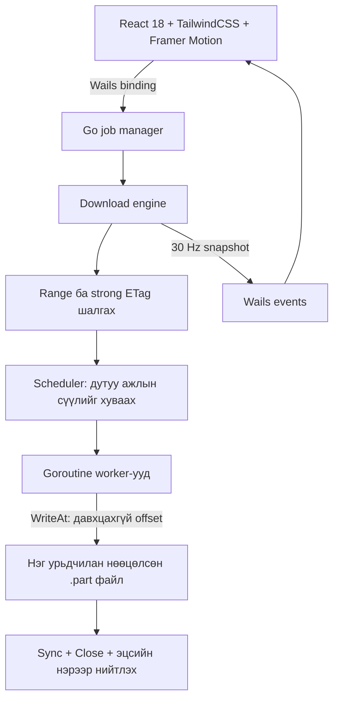

# Faster DM — дараагийн үеийн таталтын менежер

Репозиторий: https://github.com/KOMONG-Adventure/Faster_DM

Монгол хэлтэй **Wails v2 + React 18 dashboard** болон Go таталтын engine.
Давхар товшиж нээх файл: **`build/bin/FasterDM.exe`**. Таталт дуусахад цонх хаагдахгүй.

## Шууд ашиглах

### Анхны танилцуулга ба Tray

- Аппын анхны нээлтэд Монгол хэлтэй Driver.js танилцуулга автоматаар гарна.
  Дуусгах/алгасах сонголтыг тухайн WebView profile-ийн localStorage-д хадгална.
  **Танилцуулга** товчоор хэдийд ч дахин үзэж болно.
- **Суга Баяаа** нь хурааж болдог найзуудын наргианы булан; таталт өөрчлөхгүй.
- Windows дээр **Tray-д хураах** эсвэл цонхны **−** товчоор цагийн хажуугийн
  tray-д хураана. Таталт ард үргэлжилнэ. Icon дээр дарж дахин нээнэ; далд icon-ууд
  **∧** цэсэнд байж болно. Баруун товч → **Аппаас гарах** нь бүрэн хаана.
- Цонхны **×** нь өмнөх шиг аппыг хаана; идэвхтэй таталт байвал баталгаажуулна.
  Tray бэлэн биш үед цонхыг далдлахгүй. Windows бус системд tray дэмжлэг ороогүй.

### Installer-аар бусдад тараах

`FasterDM-Setup-0.3.0-x64.exe` нэг файлыг дамжуулахад хангалттай. Апп, YouTube
хэрэгслүүд, лицензүүд бүгд багтана. Windows 10/11 x64 дээр administrator эрхгүйгээр
`%LOCALAPPDATA%\Programs\FasterDM` дотор суулгана. Start Menu shortcut үүсгэнэ;
Desktop shortcut сонголттой. Windows Settings → Apps-аас устгаж болно.
Татсан файлуудыг устгахгүй. Шинэчлэхдээ ажиллаж буй аппыг эхлээд хаана.
WebView2 байхгүй компьютер дээр анх нээхэд runtime татах интернэт шаардлагатай.

Release: https://github.com/KOMONG-Adventure/Faster_DM/releases/latest

**Репозиторий private бол зөвхөн эрхтэй хүмүүс release татна.** Installer файлыг
шууд дамжуулахад GitHub эрх шаардлагагүй. Нийтэд тараах холбоосын хувьд public
release repository шаардлагатай. Суулгагч одоогоор code-signing гэрчилгээгүй;
installer болгох нь Windows-ийн итгэлцлийн анхааруулгыг автоматаар арилгахгүй.

### Terminal / Git-ээр суулгах

```powershell
git clone https://github.com/KOMONG-Adventure/Faster_DM.git
cd Faster_DM
powershell -NoProfile -ExecutionPolicy Bypass -File scripts/install.ps1
# Цонхгүй суулгах:
powershell -NoProfile -ExecutionPolicy Bypass -File scripts/install.ps1 -Silent
```

Скрипт хамгийн сүүлийн stable release installer татаж, SHA-256 шалгаад суулгана.
Go/Node build хэрэгслүүд эцсийн хэрэглэгчид шаардлагагүй. `-Version 0.3.0`-оор
тодорхой хувилбар сонгож болно. Private release татахдаа репозиторт унших эрхтэй
`GH_TOKEN` эсвэл `GITHUB_TOKEN` environment variable шаардлагатай; token-оо Git-д
хадгалж болохгүй. ExecutionPolicy нь зөвхөн тухайн PowerShell процесст үйлчилнэ.

### Installer build ба Release

```powershell
powershell -NoProfile -ExecutionPolicy Bypass -File scripts/package-windows.ps1 -Version 0.3.0
```

Үр дүн `dist/0.3.0/`: installer, `install.ps1`, `SHA256SUMS.txt`.
Inno Setup compiler-ийг албан ёсны URL, түгжсэн SHA-256-аар авч хэрэглэнэ.
GitHub Actions → **Windows installer release** → **Run workflow** эсвэл
`v0.3.1` зэрэг version tag push хийхэд installer build хийж Release-д байрлуулна.
Release version-ийг аппын update checker болон installer-д ижил оруулна.

### Portable апп ашиглах

1. `FasterDM.exe`-г нээнэ. Өөр компьютерт зөөхдөө хажуугийн `tools` хавтсыг хамт хуулна.
2. Файлын эсвэл YouTube видеоны холбоосоо оруулаад **Татаж эхлэх** дарна.
3. **Файлын нэр бичих шаардлагагүй.** Серверийн `Content-Disposition`, URL болон
   `Content-Type`-оос нэр/өргөтгөлийг автоматаар авна. Хүсвэл нэрийг өөрчилж болно.
4. Таталтыг **Түр зогсоох / Үргэлжлүүлэх** товчоор удирдана. `×` товч бүрэн цуцална.
5. Нийт хувь, татсан хэмжээ, хурд, өнгөрсөн хугацаа, үлдсэн хугацааны тооцоо болон
   хэсэг бүрийн progress-ийг дэлгэцээс харна. Дууссан файлын **Хавтас нээх** товч бий.

Анхдагч үндсэн хавтас: `%USERPROFILE%\Downloads\Faster DM`.

| Файлын төрөл | Автоматаар орох хавтас | Жишээ |
|---|---|---|
| Видео | `Videos` | mp4, mkv, webm, mov |
| Зураг | `Photos` | jpg, png, webp, gif |
| Архив | `Archives` | zip, rar, 7z, tar.gz |
| Аудио | `Audio` | mp3, m4a, flac, wav |
| Баримт | `Documents` | pdf, docx, xlsx, txt |
| Бусад | `Other` | exe, bin, танигдаагүй өргөтгөл |

Байгаа файлыг дарж бичихгүй: `name (1).zip` гэх мэт шинэ нэр өгнө.
Зэрэг 4 хүртэл файл, HTTP файл бүрд 4/8/16/32 холболт сонгож болно.

**Pause/resume:** апп нээлттэй байх хугацаанд ажиллана. HTTP Range + strong ETag
дэмжвэл дискэнд хадгалсан offset-оос үргэлжилнэ. Дэмжихгүй серверийн single-stream
таталтыг үргэлжлүүлэх үед эхнээс нь дахин татна. Pause хугацааг өнгөрсөн таталтын
хугацаанд тооцохгүй; ETA нь сүүлийн хурдны жигдрүүлсэн дунджаар бодсон ойролцоо утга.
Апп хаагдсаны дараах persistent resume/history одоогоор ороогүй.

**YouTube:** нийтэд нээлттэй нэг видеог нэрээр нь `Videos/*.mp4` болгон,
боломжтой үед 1080p хүртэл аудиотой татна. `yt-dlp` + Deno + FFmpeg ашиглана.
Энэ горимд HTTP engine-ийн chunk grid ашиглахгүй, видео/аудионы нийт явцыг харуулна.
Playlist, live stream, нэвтрэх/насны баталгаажуулалт шаардсан видеог дэмжихгүй.
YouTube-ийн үйлчилгээний өөрчлөлт, бүсийн хязгаарлалтаас таталт амжилтгүй болж болно.
Helper-уудын эх үүсвэр, лиценз: [THIRD_PARTY.md](THIRD_PARTY.md).

Шууд HTTP файл нь файлын өргөтгөлөөс үл хамааран татагдана; нэрэнд `.mp3` нэмэх нь
видеог MP3 болгон хувиргахгүй. YouTube нь одоогоор MP4 гаралттай.

## 1. Архитектур ба хамаарлууд

### Одоо байгаа бүтэц

```text
Faster_DM/
├── go.mod
├── README.md
├── .github/workflows/go.yml         # Windows/Linux тест, Linux race шалгалт
├── cmd/fasterdm/main.go             # Engine турших командын програм
└── internal/download/
    ├── types.go                    # Тохиргоо, progress DTO, үр дүн
    ├── engine.go                   # Таталтын lifecycle, worker, offset бичилт
    ├── scheduler.go                # Динамик хуваарилалт, work-stealing
    ├── http.go                     # Range шалгалт, validator, retry, idle timeout
    ├── allocate_windows.go         # Windows FileAllocationInfo
    ├── allocate_linux.go           # Linux fallocate
    ├── allocate_other.go           # Бусад OS: логик хэмжээ тогтоох
    └── engine_test.go              # Жинхэнэ HTTP test server-тэй тестүүд
```

### Dashboard-ийн нэмэлт бүтэц

```text
main.go                             # Wails v2 цонх, lifecycle
app.go                              # Start/Pause/Resume/Cancel болон Wails events
wails.json
internal/jobs/                      # Job ID, хугацаа, хурд, хавтас ангилал
internal/source/                    # Автомат файлын нэр
internal/media/                     # YouTube, yt-dlp, FFmpeg процессын lifecycle
scripts/setup-media.ps1             # Checksum шалгалттай helper татах
build.ps1                          # Windows апп build хийх
frontend/
├── package.json
└── src/
    ├── App.tsx
    ├── components/DownloadCard.tsx
    ├── components/ChunkPanel.tsx
    ├── components/AddDownload.tsx
    └── bridge.ts
```



Engine нь Wails/React-ээс хамаарахгүй. Ингэснээр HTTP болон concurrency логикийг
WebView-гүйгээр тестэлж болно. Wails bridge job бүрд тусдаа context,
progress channel үүсгэж, `download:changed` event илгээнэ. UI рүү зөвхөн
snapshot дамжина; сүлжээний buffer, file handle дамжихгүй.

### Шаардлагатай багцууд

| Давхарга | Багц / хэрэгсэл | Энэ алхмын төлөв |
|---|---|---|
| Engine | Go 1.25+; шинэ stable toolchain ашиглах | Хэрэгжсэн, engine стандарт сан ашиглана |
| Desktop | `github.com/wailsapp/wails/v2` v2.15.0 | Холбогдсон |
| UI | `react@18`, `react-dom@18` | Хэрэгжсэн |
| Style | `tailwindcss`, `@tailwindcss/vite` | Хэрэгжсэн |
| Animation | `framer-motion` | Хэрэгжсэн, reduced-motion дэмжинэ |
| Frontend build | `vite`, `@vitejs/plugin-react`, `typescript`, `@types/react@18`, `@types/react-dom@18` | Lockfile-д түгжсэн |
| OTA | `github.com/creativeprojects/go-selfupdate` эсвэл шалгасан native updater | 3-р алхамд сонгож түгжих |

Go хамаарлууд `go.mod/go.sum`, UI хамаарлууд `frontend/package-lock.json`-д түгжигдсэн.
Wails v2 хөгжүүлэлтийн үед платформын build dependencies шаардлагатай;
Windows дээр WebView2 runtime-ийг мөн шалгана.
[Wails v2 суулгах албан ёсны заавар](https://v2.wails.io/docs/gettingstarted/installation/).

## 2. Go таталтын engine

### Ажиллах дараалал

1. `GET Range: bytes=0-0` хүсэлтээр серверийн бодит Range дэмжлэгийг шалгана.
   `Accept-Ranges` header-т дангаар нь итгэхгүй, HEAD заавал шаардахгүй.
2. `206`, зөв `Content-Range`, strong ETag байвал зэрэгцээ горимд орно.
   Weak/байхгүй ETag эсвэл Range үл дэмжвэл нэг бүтэн GET ашиглана.
3. Татах хавтсанд давтагдашгүй `.part` үүсгэж, мэдэгдэж буй хэмжээний зайг нөөцөлнө.
4. Анхны ажлыг worker-уудад хуваарилна. Worker бүр өөрийн buffer-тай.
5. Дууссан worker хамгийн их дутуу байттай идэвхтэй хэсгийн нөөцлөөгүй сүүлийг
   хоёр хувааж авна. Хэсгийн доод хэмжээ болон 4096 хэсгийн дээд хязгаартай.
6. `WriteAt(buffer, offset)` ашиглан нэг файлд зэрэг бичнэ. Хэсэгчилсэн түр файлууд
   үүсгэхгүй тул эцэст нь бүх файлыг дахин хуулж нэгтгэхгүй.
7. Бүх ажил амжилттай бол нийт байтыг шалгаж, `Sync`, `Close`, hard link publication хийнэ.
   Байгаа destination-ийг эхэнд болон эцсийн нийтлэлтийн үед хамгаална.

### Work-stealing-ийн давхцахгүй бичилтийн баталгаа

Хэсэг бүр `[start, end)` интервалтай; `end` байт өөрөө тухайн хэсэгт орохгүй.
`next` нь дискэнд амжилттай бичсэн байтын дараагийн байрлал.
Worker buffer уншихын өмнө `[next, reserved)` мужийг scheduler-ийн mutex дотор
нөөцөлнө. Бусад worker зөвхөн `[reserved, end)` мужийг хувааж авна.

```text
Анхны хэсэг:
[ бичсэн ][ уншиж/бичихээр нөөцөлсөн ][       дутуу сүүл       ]
start     next                       reserved                 end

Ажил хуваасны дараа:
[ бичсэн ][ нөөцөлсөн ][ хуучин worker ][ шинэ worker          ]
start     next        reserved         mid                    end
```

Сүлжээний уншилт болон disk I/O хийх үед scheduler-ийн mutex барихгүй.
Хуучин HTTP хүсэлт урьдын урттай байсан ч worker шинэ `end` дээр зогсож,
үлдсэн response body-г хаана. Ингэснээр хоёр worker нэг байтыг зэрэг бичихгүй.
Дутуу сүүлийн **хэмжээгээр** victim сонгоно; хурдны статистикт тулгуурласан
таамаглалын scheduler энэ хувилбарт ороогүй.

### Файлын зай нөөцлөлт ба “zero-copy”

Windows дээр `SetFileInformationByHandle(FileAllocationInfo)`, Linux дээр
`fallocate` ашиглана. Эдгээр платформ дээр нөөцлөлт бүтэлгүйтвэл алдаа буцаана;
дэмжлэггүй filesystem дээр чимээгүйгээр амжилттай мэт үргэлжлэхгүй.
Бусад OS-ийн fallback нь `Truncate` буюу зөвхөн логик хэмжээ тогтооно.
Хэмжээ тодорхойгүй HTTP stream-д нийт хэмжээг урьдчилан нөөцлөх боломжгүй.
[Microsoft allocation API](https://learn.microsoft.com/en-us/windows/win32/api/winbase/ns-winbase-file_allocation_info),
[Linux fallocate](https://man7.org/linux/man-pages/man2/fallocate.2.html).

Энэ шийдэл **нэгтгэх шатны нэмэлт хуулбарыг арилгана**. HTTP/TLS → Go buffer →
`WriteAt` зам нь kernel түвшний жинхэнэ zero-copy биш. mmap өөрөө ч HTTP/TLS
тайлалтаас үүсэх бүх хуулбарыг арилгахгүй. `WriteAt` нь байршлаар бичиж,
алдааг шууд буцаадаг тул энэ хувилбарт ашигласан.
[Go os.File.WriteAt баримт](https://pkg.go.dev/os#File.WriteAt).

### HTTP болон алдааны хамгаалалт

- `Accept-Encoding: identity`; шахсан representation-ий offset-ийг андуурахгүй.
- Хэсгийн `Content-Range` эхлэл/төгсгөл/нийт хэмжээ, мэдэгдсэн `Content-Length`-ийг шалгана.
- Strong ETag-ийг `If-Match`, `If-Range`-д илгээнэ. ETag солигдох, `412` эсвэл
  Range хүсэлтэд `200` ирэх үед дутуу файлыг эцсийн файл болгон нийтлэхгүй.
- Холболт тасарвал амжилттай бичсэн `next` байрлалаас үргэлжлүүлнэ.
- `408`, `429`, сонгосон `5xx` болон түр сүлжээний алдаанд хязгаартай retry хийнэ.
  Exponential backoff + jitter ашиглаж, `Retry-After`-ийг хүндэтгэнэ.
- Idle timeout нь өгөгдөл ирэхгүй удахыг хязгаарлана; том файлын нийт таталтын
  хугацааг тогтмол 30 секундээр хязгаарлахгүй.
- Range/strong ETag байхгүй үед тасарсан бүтэн GET-ийг эхнээс нь дахин татна.
- Context cancellation бүх worker-ийг зогсооно. Disk write/sync алдаа нийт таталтыг зогсооно.
- Алдаа гарвал түр файлыг устгахыг оролдоно; өмнө байсан эцсийн файлыг хөндөхгүй.

HTTP validator нь стандарт мөрддөг серверт тулгуурлана; хортой серверийн
агуулгыг криптографаар баталгаажуулах checksum/signature механизм энд ороогүй.
[HTTP Range ба conditional request стандарт](https://www.rfc-editor.org/rfc/rfc9110.html).

### Progress ба Wails-д холбох гэрээ

`Snapshot` нь нийт байт, татсан байт, нийт хурд, төлөв болон хэсэг бүрийн
`id`, `start`, `end`, `downloaded`, `bytesPerSecond`, `status`, `retries` утгыг агуулна.
Default давтамж ≈30 Hz. Worker бичилт бүрд event гаргахгүй.

```go
cfg := download.DefaultConfig()
engine, err := download.New(cfg)
if err != nil {
    return err
}
defer engine.Close()

updates := make(chan download.Snapshot, 1)
// Өөр goroutine updates-ийг уншаад Wails event рүү дамжуулна.
result, err := engine.Download(ctx, sourceURL, destination, updates)
close(updates) // Download буцсаны дараа л хаана.
```

Энэ нь ашиглалтын хэсэгчилсэн жишээ; бүрэн runnable хувилбар `cmd/fasterdm/main.go`-д бий.
`Download` блоклодог тул Wails UI binding дотроос job goroutine эхлүүлнэ.
Channel дүүрсэн үед snapshot алгасагдана. Эцсийн амжилт/алдааны event-ийг
`Result/error`-оос тусад нь гаргах ёстой; хамгийн сүүлийн snapshot ирнэ гэж найдахгүй.
Хэсэг хуваагдах үед `end` өөрчлөгдөнө. UI блокийн өргөнийг бодит byte interval-аар
тооцох хэрэгтэй. Хэмжээ тодорхойгүй үед `total = -1`; хувь тооцохгүй.
Хурдны нэгж bytes/s, CLI-ийн дэлгэц MiB/s (`1024²`)-ээр тооцно.

### Ажиллуулах

**Windows dashboard build:** Go 1.25+, Node.js 22+, WebView2 runtime шаардлагатай.

```powershell
.\build.ps1
```

Үр дүн: `build/bin/FasterDM.exe`, YouTube helper-ууд `build/bin/tools/`.
`bin/fasterdm.exe` замд мөн GUI executable-ийн хуулбар үүсгэнэ.
Wails dev орчин: `wails dev`. Production exe нь Vite/dev server шаарддаггүй.
GitHub Actions нь push бүрд Windows portable artifact үүсгэнэ; Actions доторх
`FasterDM-Windows` artifact-ийг бүтнээр нь татаж задална.

**CLI нь тусдаа:**

PowerShell:

```powershell
go test ./internal/... ./cmd/...
go vet ./internal/... ./cmd/...
go build -o bin/fasterdm-cli.exe ./cmd/fasterdm
./bin/fasterdm-cli.exe -url "https://your-server.example/file.zip" -out "D:\Downloads\file.zip" -workers 16
```

URL-ийг бодит файлын холбоосоор солино. Хадгалах хавтас өмнө нь үүссэн байх,
харин эцсийн файл байхгүй байх шаардлагатай. `Ctrl+C` таталтыг цуцална.
Linux/macOS дээр `go run ./cmd/fasterdm -url 'https://your-server.example/file.zip' -out './file.zip'`.

Go cache бичих эрх хязгаарлагдсан орчинд:

```powershell
$env:GOCACHE = Join-Path (Get-Location) '.cache\go-build'
go test ./...
```

Race detector ажиллуулахад cgo болон нийцтэй C compiler шаардлагатай:

```powershell
$env:CGO_ENABLED = '1'
go test -race ./internal/... ./cmd/...
```

### Баталгаажуулалт ба одоогийн хязгаар

Тестүүд нь жинхэнэ local HTTP server ашиглан byte-for-byte үр дүн, work-stealing,
тасарсан холболтын resume, Range/ETag fallback, тодорхойгүй хэмжээ, хоосон файл,
буруу header, файл солигдох, retry limit, idle timeout, cancellation, destination
давхар нийтлэх өрсөлдөөнийг шалгана. CI нь Windows/Linux тест, Linux race detector
ажиллуулахаар тохируулсан; энэ workflow өөрөө GitHub дээр ажилласан гэсэн үг биш.

- Эцсийн нийтлэлт hard link шаарддаг: NTFS болон дэмждэг POSIX filesystem ашиглана.
  FAT/exFAT-д portable no-overwrite publication хараахан хэрэгжээгүй.
- Апп хаагдсаны дараах persistent pause/resume manifest ороогүй. Алдаа/цуцлалтад
  partial-ийг цэвэрлэнэ; process crash үлдээсэн `.part`-ийг автоматаар сэргээхгүй.
- Power-loss үеийн directory durability, гарын үсэгтэй checksum, browser integration,
  per-host rate limiting, cookie/auth UI дараагийн бүтээгдэхүүний түвшний ажилд орно.
- Анхдагчаар 16 worker × 128 KiB ≈2 MiB application buffer хэрэглэнэ; HTTP/TLS,
  snapshot болон OS cache-ийн нэмэлт санах ой үүнд ороогүй.
- IDM/aria2-аас хурдан гэдгийг хараахан benchmark-аар батлаагүй. Ижил сервер,
  bandwidth, диск, файлын хэмжээ, зэрэгцээ холболтын хязгаартай орчинд хэмжих шаардлагатай.

### Том файл ба хурдны үзүүлэлт

- **Автомат · 4–32** нь анхдагч холболтын горим. 64 MiB болон түүнээс том,
  Range ба strong ETag дэмждэг файлд 4 холболтоос эхэлнэ. 3 секунд тутам хурдыг
  хэмжиж 8/16/32 хүртэл нэмнэ; туршилтын өсөлт 8%-д хүрэхгүй бол бууруулж,
  30 секунд хүлээнэ. Retry нэмэгдэхэд мөн холболтыг бууруулна.
- Автомат горим 512 KiB буфер ашиглана. Жижиг файлыг 4 хүртэл, Range/strong
  ETag байхгүй файлыг нэг холболтоор татна. Гараар 4/8/16/32 сонгох боломж хэвээр.
- **NETWORK / PEAK** нь Mbps (бит/секунд), **DISK USAGE** нь MB/s (байт/секунд).
  Сүлжээний хэмжилт таталтын HTTP body-д уншсан байтад, дискнийх амжилттай
  `WriteAt` хийсэн байтад тулгуурлана. OS cache багтдаг тул физик дискний ачаалал
  эсвэл cache flush хурд биш. PEAK нь энэ dashboard session-ийн 0.5 секундийн
  дээжлэлтийн хамгийн өндөр нийлбэр хурд; график сүүлийн 30 секундийг харуулна.
- YouTube-ийн сүлжээний хурд yt-dlp-ээс ирнэ; дискний хэмжилт байхгүй үед `—`
  харуулна. Шинэ горимын хурдны өсөлтийг бодит сервер дээр benchmark хийгээгүй.

### Шинэчлэлт ба дараагийн алхам

Sidebar-ийн **Шинэчлэлт шалгах** товч GitHub Releases-ийн хамгийн сүүлийн
тогтвортой хувилбарыг шалгаж, одоогийн хувилбар болон шалгасан цагийг харуулна.
Шинэ хувилбарыг **GitHub Releases** товчоор нээж татна. Зөвхөн git push хийх нь
release нийтлэхгүй. Нийтэд нээлттэй release байхгүй бол үүнийг тусад нь мэдэгдэнэ.
Энэ товч EXE-г автоматаар солихгүй. Release build-ийн хувилбарыг
`-ldflags "-X github.com/KOMONG-Adventure/Faster_DM/internal/updates.Version=0.3.0"`
аргаар тохируулна.

3. GitHub Releases updater: хувилбар/OS/архитектур шалгалт, баталгаажуулсан artifact,
   rollback болон graceful restart. Windows дээр ажиллаж буй `.exe`-г шууд дарж
   бичихэд найдахгүй; process гарсны дараа солих туслах процесс хэрэгтэй.
4–5-р алхмын dashboard болон Wails bindings хэрэгжсэн. OTA updater болон
итгэмжлэгдсэн code signing одоогоор ороогүй.
