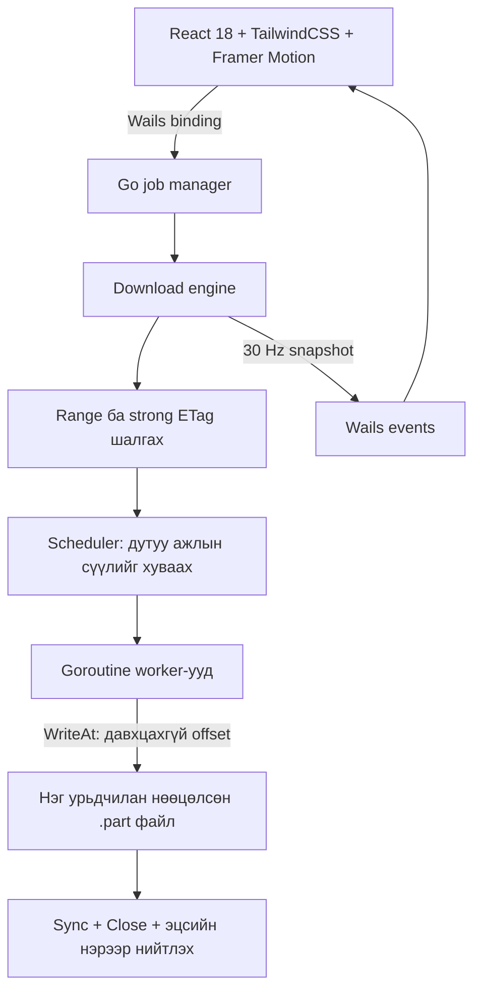

# Faster DM — дараагийн үеийн таталтын менежер

Репозиторий: https://github.com/KOMONG-Adventure/Faster_DM

Энэ хувилбар **1-р алхам: архитектур**, **2-р алхам: Go таталтын engine**-ийг хэрэгжүүлсэн.
Кодын тайлбар, ажиллуулах заавар монгол хэлтэй. Одоогоор ажиллах CLI бий;
Wails цонх, React UI, OTA updater нь дараагийн 3–5-р алхамд нэмэгдэнэ.

## 1. Архитектур ба хамаарлууд

### Одоо байгаа бүтэц

```text
Faster_DM/
├── go.mod
├── README.md
├── .github/workflows/go.yml         # Windows/Linux тест, Linux race шалгалт
├── cmd/fasterdm/main.go             # Engine турших командын програм
└── internal/download/
    ├── types.go                    # Тохиргоо, progress DTO, үр дүн
    ├── engine.go                   # Таталтын lifecycle, worker, offset бичилт
    ├── scheduler.go                # Динамик хуваарилалт, work-stealing
    ├── http.go                     # Range шалгалт, validator, retry, idle timeout
    ├── allocate_windows.go         # Windows FileAllocationInfo
    ├── allocate_linux.go           # Linux fallocate
    ├── allocate_other.go           # Бусад OS: логик хэмжээ тогтоох
    └── engine_test.go              # Жинхэнэ HTTP test server-тэй тестүүд
```

### Дараагийн алхмуудын бүтэц

```text
main.go                             # Wails v2 цонх, lifecycle
app.go                              # StartDownload/CancelDownload binding
wails.json
internal/jobs/                      # Job ID, queue, context cancellation
internal/updater/                   # GitHub Releases, шалгалт, restart helper
frontend/
├── package.json
└── src/
    ├── App.tsx
    ├── components/DownloadCard.tsx
    ├── components/ChunkMap.tsx
    └── hooks/useDownloadEvents.ts
```



Engine нь Wails/React-ээс хамаарахгүй. Ингэснээр HTTP болон concurrency логикийг
WebView-гүйгээр тестэлж болно. Wails bridge дараа нь job бүрд тусдаа context,
progress channel үүсгэж, `download:progress` event илгээнэ. UI рүү зөвхөн
snapshot дамжина; сүлжээний buffer, file handle дамжихгүй.

### Шаардлагатай багцууд

| Давхарга | Багц / хэрэгсэл | Энэ алхмын төлөв |
|---|---|---|
| Engine | Go 1.22+; шинэ stable toolchain ашиглах | Хэрэгжсэн, зөвхөн стандарт сан |
| Desktop | `github.com/wailsapp/wails/v2` | 5-р алхамд холбох |
| UI | `react@18`, `react-dom@18` | 4-р алхамд |
| Style | `tailwindcss`, `@tailwindcss/vite` | 4-р алхамд |
| Animation | `framer-motion` | 4-р алхамд |
| Frontend build | `vite`, `@vitejs/plugin-react`, `typescript`, `@types/react@18`, `@types/react-dom@18` | 4-р алхамд |
| OTA | `github.com/creativeprojects/go-selfupdate` эсвэл шалгасан native updater | 3-р алхамд сонгож түгжих |

Одоогийн engine-д `go get` болон `npm install` шаардлагагүй. UI/updater багцуудыг
хэрэгжүүлэх үед нийцтэй хувилбаруудыг сонгож, `go.sum` болон NPM lockfile-д түгжинэ.
Wails v2 хөгжүүлэлтийн үед платформын build dependencies шаардлагатай;
Windows дээр WebView2 runtime-ийг мөн шалгана.
[Wails v2 суулгах албан ёсны заавар](https://v2.wails.io/docs/gettingstarted/installation/).

## 2. Go таталтын engine

### Ажиллах дараалал

1. `GET Range: bytes=0-0` хүсэлтээр серверийн бодит Range дэмжлэгийг шалгана.
   `Accept-Ranges` header-т дангаар нь итгэхгүй, HEAD заавал шаардахгүй.
2. `206`, зөв `Content-Range`, strong ETag байвал зэрэгцээ горимд орно.
   Weak/байхгүй ETag эсвэл Range үл дэмжвэл нэг бүтэн GET ашиглана.
3. Татах хавтсанд давтагдашгүй `.part` үүсгэж, мэдэгдэж буй хэмжээний зайг нөөцөлнө.
4. Анхны ажлыг worker-уудад хуваарилна. Worker бүр өөрийн buffer-тай.
5. Дууссан worker хамгийн их дутуу байттай идэвхтэй хэсгийн нөөцлөөгүй сүүлийг
   хоёр хувааж авна. Хэсгийн доод хэмжээ болон 4096 хэсгийн дээд хязгаартай.
6. `WriteAt(buffer, offset)` ашиглан нэг файлд зэрэг бичнэ. Хэсэгчилсэн түр файлууд
   үүсгэхгүй тул эцэст нь бүх файлыг дахин хуулж нэгтгэхгүй.
7. Бүх ажил амжилттай бол нийт байтыг шалгаж, `Sync`, `Close`, hard link publication хийнэ.
   Байгаа destination-ийг эхэнд болон эцсийн нийтлэлтийн үед хамгаална.

### Work-stealing-ийн давхцахгүй бичилтийн баталгаа

Хэсэг бүр `[start, end)` интервалтай; `end` байт өөрөө тухайн хэсэгт орохгүй.
`next` нь дискэнд амжилттай бичсэн байтын дараагийн байрлал.
Worker buffer уншихын өмнө `[next, reserved)` мужийг scheduler-ийн mutex дотор
нөөцөлнө. Бусад worker зөвхөн `[reserved, end)` мужийг хувааж авна.

```text
Анхны хэсэг:
[ бичсэн ][ уншиж/бичихээр нөөцөлсөн ][       дутуу сүүл       ]
start     next                       reserved                 end

Ажил хуваасны дараа:
[ бичсэн ][ нөөцөлсөн ][ хуучин worker ][ шинэ worker          ]
start     next        reserved         mid                    end
```

Сүлжээний уншилт болон disk I/O хийх үед scheduler-ийн mutex барихгүй.
Хуучин HTTP хүсэлт урьдын урттай байсан ч worker шинэ `end` дээр зогсож,
үлдсэн response body-г хаана. Ингэснээр хоёр worker нэг байтыг зэрэг бичихгүй.
Дутуу сүүлийн **хэмжээгээр** victim сонгоно; хурдны статистикт тулгуурласан
таамаглалын scheduler энэ хувилбарт ороогүй.

### Файлын зай нөөцлөлт ба “zero-copy”

Windows дээр `SetFileInformationByHandle(FileAllocationInfo)`, Linux дээр
`fallocate` ашиглана. Эдгээр платформ дээр нөөцлөлт бүтэлгүйтвэл алдаа буцаана;
дэмжлэггүй filesystem дээр чимээгүйгээр амжилттай мэт үргэлжлэхгүй.
Бусад OS-ийн fallback нь `Truncate` буюу зөвхөн логик хэмжээ тогтооно.
Хэмжээ тодорхойгүй HTTP stream-д нийт хэмжээг урьдчилан нөөцлөх боломжгүй.
[Microsoft allocation API](https://learn.microsoft.com/en-us/windows/win32/api/winbase/ns-winbase-file_allocation_info),
[Linux fallocate](https://man7.org/linux/man-pages/man2/fallocate.2.html).

Энэ шийдэл **нэгтгэх шатны нэмэлт хуулбарыг арилгана**. HTTP/TLS → Go buffer →
`WriteAt` зам нь kernel түвшний жинхэнэ zero-copy биш. mmap өөрөө ч HTTP/TLS
тайлалтаас үүсэх бүх хуулбарыг арилгахгүй. `WriteAt` нь байршлаар бичиж,
алдааг шууд буцаадаг тул энэ хувилбарт ашигласан.
[Go os.File.WriteAt баримт](https://pkg.go.dev/os#File.WriteAt).

### HTTP болон алдааны хамгаалалт

- `Accept-Encoding: identity`; шахсан representation-ий offset-ийг андуурахгүй.
- Хэсгийн `Content-Range` эхлэл/төгсгөл/нийт хэмжээ, мэдэгдсэн `Content-Length`-ийг шалгана.
- Strong ETag-ийг `If-Match`, `If-Range`-д илгээнэ. ETag солигдох, `412` эсвэл
  Range хүсэлтэд `200` ирэх үед дутуу файлыг эцсийн файл болгон нийтлэхгүй.
- Холболт тасарвал амжилттай бичсэн `next` байрлалаас үргэлжлүүлнэ.
- `408`, `429`, сонгосон `5xx` болон түр сүлжээний алдаанд хязгаартай retry хийнэ.
  Exponential backoff + jitter ашиглаж, `Retry-After`-ийг хүндэтгэнэ.
- Idle timeout нь өгөгдөл ирэхгүй удахыг хязгаарлана; том файлын нийт таталтын
  хугацааг тогтмол 30 секундээр хязгаарлахгүй.
- Range/strong ETag байхгүй үед тасарсан бүтэн GET-ийг эхнээс нь дахин татна.
- Context cancellation бүх worker-ийг зогсооно. Disk write/sync алдаа нийт таталтыг зогсооно.
- Алдаа гарвал түр файлыг устгахыг оролдоно; өмнө байсан эцсийн файлыг хөндөхгүй.

HTTP validator нь стандарт мөрддөг серверт тулгуурлана; хортой серверийн
агуулгыг криптографаар баталгаажуулах checksum/signature механизм энд ороогүй.
[HTTP Range ба conditional request стандарт](https://www.rfc-editor.org/rfc/rfc9110.html).

### Progress ба Wails-д холбох гэрээ

`Snapshot` нь нийт байт, татсан байт, нийт хурд, төлөв болон хэсэг бүрийн
`id`, `start`, `end`, `downloaded`, `bytesPerSecond`, `status`, `retries` утгыг агуулна.
Default давтамж ≈30 Hz. Worker бичилт бүрд event гаргахгүй.

```go
cfg := download.DefaultConfig()
engine, err := download.New(cfg)
if err != nil {
    return err
}
defer engine.Close()

updates := make(chan download.Snapshot, 1)
// Өөр goroutine updates-ийг уншаад Wails event рүү дамжуулна.
result, err := engine.Download(ctx, sourceURL, destination, updates)
close(updates) // Download буцсаны дараа л хаана.
```

Энэ нь ашиглалтын хэсэгчилсэн жишээ; бүрэн runnable хувилбар `cmd/fasterdm/main.go`-д бий.
`Download` блоклодог тул Wails UI binding дотроос job goroutine эхлүүлнэ.
Channel дүүрсэн үед snapshot алгасагдана. Эцсийн амжилт/алдааны event-ийг
`Result/error`-оос тусад нь гаргах ёстой; хамгийн сүүлийн snapshot ирнэ гэж найдахгүй.
Хэсэг хуваагдах үед `end` өөрчлөгдөнө. UI блокийн өргөнийг бодит byte interval-аар
тооцох хэрэгтэй. Хэмжээ тодорхойгүй үед `total = -1`; хувь тооцохгүй.
Хурдны нэгж bytes/s, CLI-ийн дэлгэц MiB/s (`1024²`)-ээр тооцно.

### Ажиллуулах

PowerShell:

```powershell
go test ./...
go vet ./...
go build -o bin/fasterdm.exe ./cmd/fasterdm
./bin/fasterdm.exe -url "https://your-server.example/file.zip" -out "D:\Downloads\file.zip" -workers 16
```

URL-ийг бодит файлын холбоосоор солино. Хадгалах хавтас өмнө нь үүссэн байх,
харин эцсийн файл байхгүй байх шаардлагатай. `Ctrl+C` таталтыг цуцална.
Linux/macOS дээр `go run ./cmd/fasterdm -url 'https://your-server.example/file.zip' -out './file.zip'`.

Go cache бичих эрх хязгаарлагдсан орчинд:

```powershell
$env:GOCACHE = Join-Path (Get-Location) '.cache\go-build'
go test ./...
```

Race detector ажиллуулахад cgo болон нийцтэй C compiler шаардлагатай:

```powershell
$env:CGO_ENABLED = '1'
go test -race ./...
```

### Баталгаажуулалт ба одоогийн хязгаар

Тестүүд нь жинхэнэ local HTTP server ашиглан byte-for-byte үр дүн, work-stealing,
тасарсан холболтын resume, Range/ETag fallback, тодорхойгүй хэмжээ, хоосон файл,
буруу header, файл солигдох, retry limit, idle timeout, cancellation, destination
давхар нийтлэх өрсөлдөөнийг шалгана. CI нь Windows/Linux тест, Linux race detector
ажиллуулахаар тохируулсан; энэ workflow өөрөө GitHub дээр ажилласан гэсэн үг биш.

- Эцсийн нийтлэлт hard link шаарддаг: NTFS болон дэмждэг POSIX filesystem ашиглана.
  FAT/exFAT-д portable no-overwrite publication хараахан хэрэгжээгүй.
- Апп хаагдсаны дараах persistent pause/resume manifest ороогүй. Алдаа/цуцлалтад
  partial-ийг цэвэрлэнэ; process crash үлдээсэн `.part`-ийг автоматаар сэргээхгүй.
- Power-loss үеийн directory durability, гарын үсэгтэй checksum, browser integration,
  per-host rate limiting, cookie/auth UI дараагийн бүтээгдэхүүний түвшний ажилд орно.
- Анхдагчаар 16 worker × 128 KiB ≈2 MiB application buffer хэрэглэнэ; HTTP/TLS,
  snapshot болон OS cache-ийн нэмэлт санах ой үүнд ороогүй.
- IDM/aria2-аас хурдан гэдгийг хараахан benchmark-аар батлаагүй. Ижил сервер,
  bandwidth, диск, файлын хэмжээ, зэрэгцээ холболтын хязгаартай орчинд хэмжих шаардлагатай.

### Дараагийн алхам

3. GitHub Releases updater: хувилбар/OS/архитектур шалгалт, баталгаажуулсан artifact,
   rollback болон graceful restart. Windows дээр ажиллаж буй `.exe`-г шууд дарж
   бичихэд найдахгүй; process гарсны дараа солих туслах процесс хэрэгтэй.
4. Монгол хэлтэй React 18/Tailwind/Framer Motion UI, нийт progress ба chunk map.
5. Wails v2 bindings, job lifecycle, progress event болон cancel ажиллагаа.
